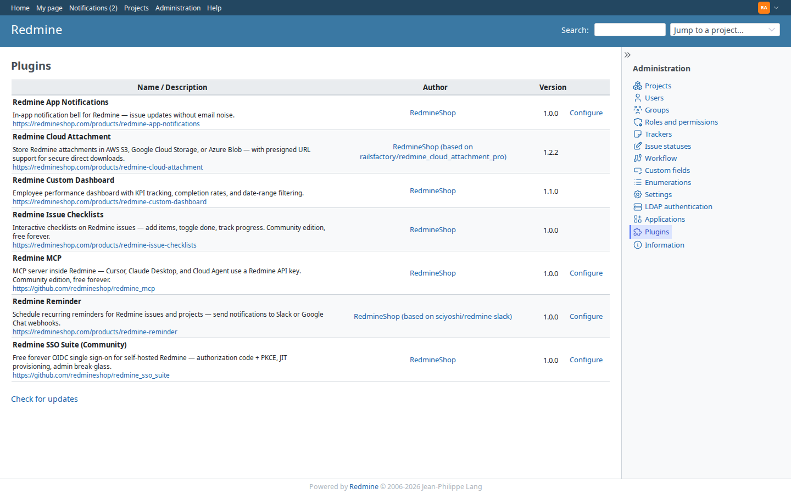
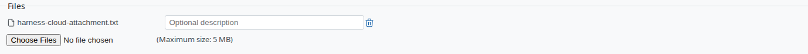
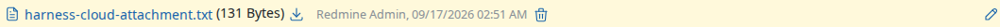

# Redmine Cloud Attachment — S3, GCS & Azure Storage for Redmine

[](https://redmineshop.com/products/redmine-cloud-attachment)
[](https://redmineshop.com/docs/compatibility)
[](LICENSE.txt)
[](https://github.com/redmineshop/redmine_cloud_attachment/actions/workflows/ci.yml)

**Last maintained:** 2026-09-18

**Source on GitHub:** [github.com/redmineshop/redmine_cloud_attachment](https://github.com/redmineshop/redmine_cloud_attachment)

Store Redmine issue attachments in cloud object storage — AWS S3, Google Cloud Storage, or Azure Blob — instead of local disk. Supports presigned URLs for secure, time-limited direct download links that bypass your Redmine server.

## Features

- Route Redmine file uploads directly to AWS S3, GCS, or Azure Blob
- Presigned URL downloads — files served directly from cloud, not through Redmine server
- Streaming uploads (SHA256 digest without loading the whole file into memory)
- Configurable via `config/configuration.yml` (no Admin UI settings page)
- Compatible with Redmine's built-in attachment management UI

## Requirements

- Redmine 5.0.x or 6.x
- Ruby 3.0+
- AWS S3 bucket (+ IAM credentials or instance profile), GCS bucket, or Azure Storage account

### IAM (S3) minimum

Grant `s3:GetObject`, `s3:PutObject`, and `s3:DeleteObject` on your attachments bucket/prefix.

## Installation

Clone from GitHub, then install gems:

```bash
cd /path/to/redmine/plugins
git clone https://github.com/redmineshop/redmine_cloud_attachment.git
cd /path/to/redmine
bundle install
# Restart your Redmine server
```

See the [install guide](https://redmineshop.com/docs/cloud-attachment-install) for full instructions.

### Upgrading from `redmine_cloud_attachment_pro` (≤ 1.1.x)

```bash
mv plugins/redmine_cloud_attachment_pro plugins/redmine_cloud_attachment
bundle install
# Restart Redmine
```

Optional: rename `cloud_attachment_pro:` → `cloud_attachment:` in `configuration.yml` (legacy key still works).

## Configuration

Edit `config/configuration.yml` (see `config/configuration.yml.sample`). There is **no** “Configure” link under Administration → Plugins for this plugin.

### AWS S3 example

```yaml
production:
  storage: :s3
  s3:
    enabled: true
    access_key_id: <%= ENV["AWS_ACCESS_KEY"] %>
    secret_access_key: <%= ENV["AWS_SECRET_KEY"] %>
    bucket: <%= ENV["REDMINE_FILES_ATTACHEMENT_S3_BUCKET"] %>
    region: <%= ENV["AWS_REGION"] %>
    path: redmine/files
  cloud_attachment:
    presigned_url_expires_in: 15
```

Presigned download URLs expire after the configured minutes (default 15). Do not treat them as permanent links.

### MinIO / S3-compatible example

```yaml
production:
  storage: :s3
  s3:
    enabled: true
    access_key_id: minioadmin
    secret_access_key: minioadmin
    bucket: redmine-attachments
    region: us-east-1
    path: redmine/files
    endpoint: http://minio:9000
    # Host the browser can reach for presigned downloads (optional but required in Docker)
    public_endpoint: http://localhost:9000
    force_path_style: true
```

`endpoint` is used for put/get/delete from the Redmine process. When `public_endpoint` is set,
presigned download URLs are signed against that host instead (so redirects work outside Docker).

## Compatibility

| Redmine | Ruby | Database | Status |
|---------|------|----------|--------|
| 6.x     | 3.2+ | MySQL 8 / PostgreSQL | Targeted — **untested** (no published QA matrix) |
| 5.1.x   | 3.1+ | MySQL 8 / PostgreSQL | Targeted — **untested** |
| 5.0.x   | 3.0+ | MySQL 8 / PostgreSQL | Targeted — **untested** |

Do not treat catalog versions as tested cells. This plugin does not declare `requires_redmine` in `init.rb`.

## Screenshot

Administration → Plugins on demo Redmine. There is **no** Configure link — storage is `config/configuration.yml` (MinIO on the demo stack):



Issue Files field after choosing a file:



Attachments list after save:



Screenshot refresh lives in the private `redmineshop/redmineshop` harness. A public clone cannot run it.

## Tests

Unit + integration tests live under `test/` (MiniTest). They are **not** a Redmine 5.1 / 6.x matrix.

On the private `redmineshop/redmineshop` demo stack (not this public clone):

```bash
PLUGIN_NAME=redmine_cloud_attachment ./demo/scripts/run-sso-plugin-tests.sh
```

A public clone of this plugin does not ship `demo/scripts/`.

### Quality harness (demo + E2E)

E2E lives in the **private** `redmineshop/redmineshop` harness (`docker-compose.demo.yml` + Playwright). This public GitHub repo is the plugin only — it does not ship that compose file, and a public clone cannot open private harness docs.

Install and smoke this plugin on your own Redmine: [cloud attachment install](https://redmineshop.com/docs/cloud-attachment-install).

| Bar | Status |
| --- | --- |
| Automated tests beyond `ruby -c` | **Verified** — `test/unit` + `test/integration` in this repo (Playwright is a separate row) |
| E2E primary happy path | **Verified** — Playwright on that private harness (plugin row, attach file, download 302 to MinIO) |
| Installed + enabled on demo Redmine | **Verified** — mounted via `demo/plugins/` on the private monorepo demo stack; seed prepares `plugin-qa` and checks `storage=s3` (MinIO) |
| UI screenshot in README | **Verified** — `screenshots/{admin-plugins,issue-edit-files,issue-attachment}.png` from that spec |
| Redmine 5.1 / 6.x matrix | **Declared / untested** — this harness is one demo image, not a QA matrix |

## Troubleshooting

See [docs/cloud-attachment-troubleshooting](https://redmineshop.com/docs/cloud-attachment-troubleshooting) or open an issue at [GitHub Issues](https://github.com/redmineshop/redmine_cloud_attachment/issues).

## License

MIT — see [LICENSE.txt](LICENSE.txt). Based on [railsfactory-sivamanikandan/redmine_cloud_attachment_pro](https://github.com/railsfactory-sivamanikandan/redmine_cloud_attachment_pro).
