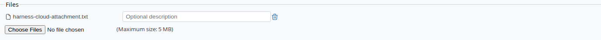
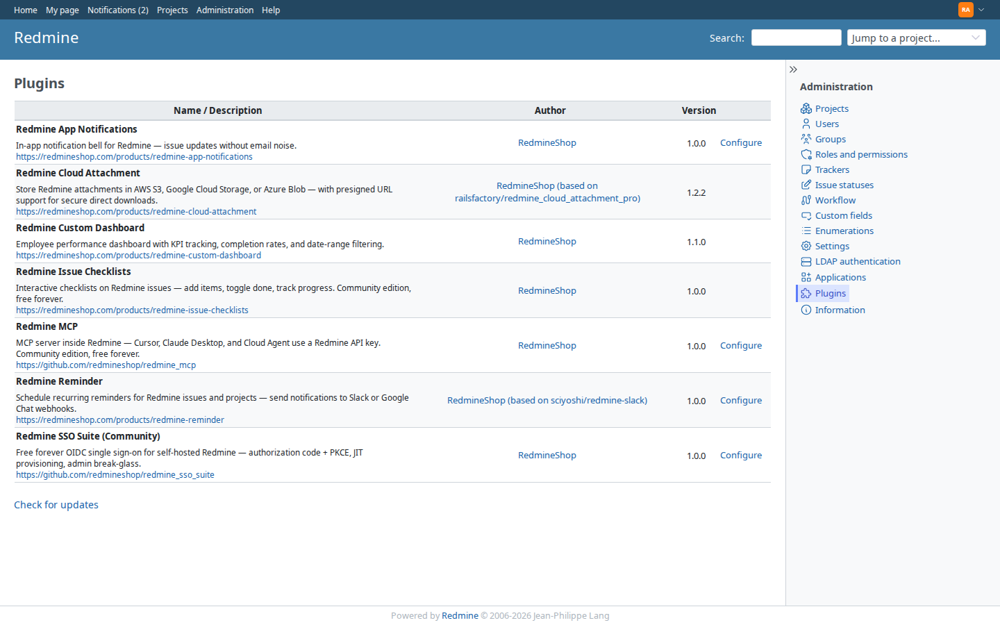

# Redmine Cloud Attachment — S3, GCS & Azure Storage for Redmine

[](https://redmineshop.com/products/redmine-cloud-attachment)
[](https://github.com/redmineshop/redmine_cloud_attachment/actions/workflows/ci.yml)
[](LICENSE.txt)
[](https://github.com/redmineshop/redmine_cloud_attachment/actions/workflows/ci.yml)

**Last maintained:** 2026-10-07

**Source on GitHub:** [github.com/redmineshop/redmine_cloud_attachment](https://github.com/redmineshop/redmine_cloud_attachment)

Store Redmine issue attachments in cloud object storage — AWS S3, Google Cloud Storage, or Azure Blob — instead of local disk. Supports presigned URLs for secure, time-limited direct download links that bypass your Redmine server.

## Features

- Route Redmine file uploads directly to AWS S3, GCS, or Azure Blob
- Presigned URL downloads — files served directly from cloud, not through Redmine server
- Streaming uploads (SHA256 digest without loading the whole file into memory)
- Configurable via `config/configuration.yml` (no Admin UI settings page)
- Compatible with Redmine's built-in attachment management UI

## Requirements

- Redmine 5.0 or newer is declared. Public CI verifies Redmine 7.0.1 only
- Ruby 3.0+ is declared. Public CI uses Ruby 3.2.3
- MySQL 8 or PostgreSQL. Public CI uses MySQL 8.0.46. PostgreSQL was not run
- AWS S3 bucket (+ IAM credentials or instance profile), GCS bucket, Azure Storage account, or any S3-compatible endpoint such as MinIO

### IAM (S3) minimum

Grant `s3:GetObject`, `s3:PutObject`, and `s3:DeleteObject` on your attachments bucket/prefix.

## Installation

Clone from GitHub, then install gems:

```bash
cd /path/to/redmine/plugins
git clone https://github.com/redmineshop/redmine_cloud_attachment.git
cd /path/to/redmine
bundle install
# Restart your Redmine server
```

See the [install guide](https://redmineshop.com/docs/cloud-attachment-install) for full instructions.

### Upgrading from `redmine_cloud_attachment_pro` (≤ 1.1.x)

```bash
mv plugins/redmine_cloud_attachment_pro plugins/redmine_cloud_attachment
bundle install
# Restart Redmine
```

Optional: rename `cloud_attachment_pro:` → `cloud_attachment:` in `configuration.yml` (legacy key still works).

## Configuration

Edit `config/configuration.yml` (see `config/configuration.yml.sample`). There is **no** “Configure” link under Administration → Plugins for this plugin.

### AWS S3 example

```yaml
production:
  storage: :s3
  s3:
    enabled: true
    access_key_id: <%= ENV["AWS_ACCESS_KEY"] %>
    secret_access_key: <%= ENV["AWS_SECRET_KEY"] %>
    bucket: <%= ENV["REDMINE_FILES_ATTACHEMENT_S3_BUCKET"] %>
    region: <%= ENV["AWS_REGION"] %>
    path: redmine/files
  cloud_attachment:
    presigned_url_expires_in: 15
```

Presigned download URLs expire after the configured minutes (default 15). Do not treat them as permanent links.

### MinIO / S3-compatible example

```yaml
production:
  storage: :s3
  s3:
    enabled: true
    access_key_id: minioadmin
    secret_access_key: minioadmin
    bucket: redmine-attachments
    region: us-east-1
    path: redmine/files
    endpoint: http://minio:9000
    # Host the browser can reach for presigned downloads (optional but required in Docker)
    public_endpoint: http://localhost:9000
    force_path_style: true
```

`endpoint` is used for put/get/delete from the Redmine process. When `public_endpoint` is set,
presigned download URLs are signed against that host instead (so redirects work outside Docker).
A download redirect is sent only when that URL's host is the configured storage host. Any other
host falls back to sending the file through Redmine. Presigned link lifetime is clamped to
between 1 minute and 7 days.

## Compatibility

| Redmine | Ruby | Database | Status |
|---------|------|----------|--------|
| 7.0.1   | 3.2.3 | MySQL 8.0.46 | **Verified in CI** — checks out Redmine 7.0.1, installs this plugin, runs migrations, and runs the plugin MiniTest suite with MinIO for the S3 upload, download, and delete tests |
| 6.x     | 3.2+ | MySQL 8 / PostgreSQL | Declared — **untested** |
| 5.1.x   | 3.1+ | MySQL 8 / PostgreSQL | Declared — **untested** |
| 5.0.x   | 3.0+ | MySQL 8 / PostgreSQL | Declared — **untested** |

The plugin does not declare `requires_redmine` in `init.rb`. Only the 7.0.1 / Ruby 3.2.3 / MySQL 8.0.46 cell was run. PostgreSQL was not run. Other 7.0 patch releases were not run. Do not treat the 5.x and 6.x rows as tested.

## Screenshot

Issue page after a file is stored in cloud storage (demo Redmine + MinIO). The attachment row is the standard Redmine Files list. This plugin does not print the bucket or provider on the issue, and it has **no** Administration → Plugins → Configure screen — storage is `config/configuration.yml`, so there is no settings screenshot (keys stay out of the UI).


Issue edit page with a file chosen, before submit:



Administration → Plugins (no Configure link):



These screenshots were not regenerated for the public CI job.

## Tests

MiniTest lives under `test/`. It covers:

- Object keys, including encoded `..` segments, and presigned-host checks
- Presigned URL lifetime clamped between 1 minute and 7 days
- Log redaction of signed URL queries and access keys
- Upload routed to the S3 client, local storage when cloud storage is off, and delete of the object
- Download authorization: anonymous users, private issues, and bulk download without `view_files`
- A mismatched filename, an off-host presign (file is sent by Redmine instead), and a missing object
- No admin settings form, and a settings POST without a CSRF token is rejected

Public CI (`.github/workflows/ci.yml`) has two jobs:

- Ruby syntax (`ruby -c`) and `test/unit/storage_security_test.rb` on Ruby 3.2. That job does not boot Redmine.
- Redmine 7.0.1 with MySQL 8.0.46. The job checks the plugin out into `plugins/redmine_cloud_attachment`, starts MinIO, runs `db:migrate` and `redmine:plugins:migrate`, then `rake redmine:plugins:test NAME=redmine_cloud_attachment` (unit, functional, and integration).

On a Redmine install that already has this plugin:

```bash
bundle exec rake redmine:plugins:test NAME=redmine_cloud_attachment RAILS_ENV=test
```

This plugin does not add tables. `redmine:plugins:migrate` is still run in CI.

This repository does not run a browser end-to-end test. Install the plugin on your own Redmine with the steps in [Installation](#installation). Notes: [cloud attachment install](https://redmineshop.com/docs/cloud-attachment-install).

| Bar | Status |
| --- | --- |
| MiniTest on Redmine 7.0.1 + MySQL 8 + MinIO | **Verified in CI** — Ruby 3.2.3. The run count is the summary printed by that job |
| Redmine 5.x / 6.x | **Declared / untested** |
| PostgreSQL | **Not run** |
| Browser end-to-end | **Not in this repository** |
| README screenshots | **Present** — `screenshots/issue-attachment.png`, `screenshots/issue-edit-files.png`, `screenshots/admin-plugins.png`. Not regenerated for the public CI job |
| Live demo install | **Not re-checked** for this CI job |

## Troubleshooting

See [docs/cloud-attachment-troubleshooting](https://redmineshop.com/docs/cloud-attachment-troubleshooting) or open an issue at [GitHub Issues](https://github.com/redmineshop/redmine_cloud_attachment/issues).

## License

MIT — see [LICENSE.txt](LICENSE.txt). Based on [railsfactory-sivamanikandan/redmine_cloud_attachment_pro](https://github.com/railsfactory-sivamanikandan/redmine_cloud_attachment_pro).
